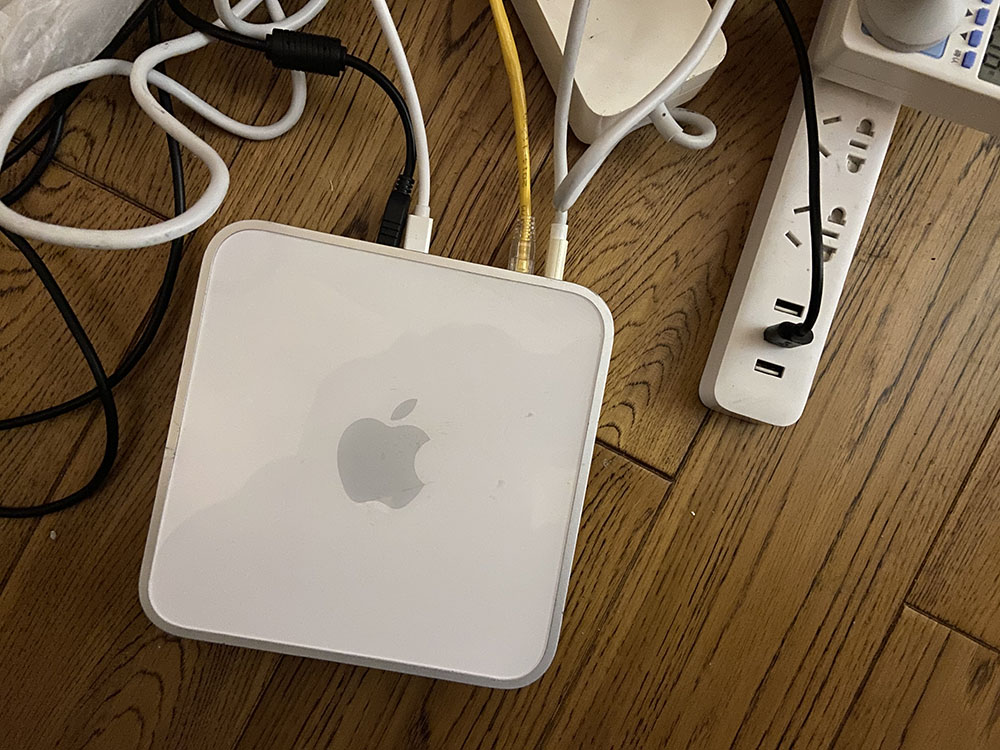

# Boot Arch Linux on 32Bit EFI



在有些上古的机型上例如上网本和早期的基于 Intel Mac 设备，可能部署的是 32 位的 UEF 系统，但是搭载的是 64 位的处理器。

这些机型无法使用现代的 ISO 刻录镜像的方式引导系统，因为目前主流大部分平台都是使用的是 64 位的 UEFI 和处理器。我们需要针对这些上古的机型做些特殊的引导处理，以方便安装现代的操作系统。

建立这个项目的原因也是因为如此，个人从咸鱼上花了 200 （包邮）淘到台 2007 年款的 Mac Mini（Macmini2,1），它使用的就是上述的 32 位 EFI。小提示：2009 年及以后的 Mac 搭载的均为 64 位的 UEFI，不需要做任何处理。

我成功通过这个 32Bit GRUB 引导 Arch 20200301 的安装盘并在 Macmini2,1 上安装了其系统。下面是简单的说明：

这个 32Bit GRUB 文件提取自 Fedora 31，如果您觉得安装 Arch 比较麻烦，那么可以直接安装使用 Fedora 系统。Fedora 自 27 以后增加了 32 位 EFI 的引导支持。

## 使用步骤

首先，找个 U 盘分区为 MBR 分区格式，并格式化为 FAT32 格式，同时记住这个分区的 UUID 。

然后将 EFI 目录拷贝到这个 FAT32 的分区中，修改 `/EFI/BOOT/grub.cfg` 中的内容，将对应：`set imgdevpath="/dev/disk/by-uuid/7149-1BE9"` 修改为上述格式化完的 UUID，保存关闭文件。

然后将最新的 archlinux 安装 iso 重命名为 boot.iso 拷贝到 `/EFI/BOOT/boot-isos` 中即可，注意 FAT32 大小写不敏感。

这样子启动安装盘就制作完成了，如果您需要安装其他系统，也可以参考类似的方法。注意，由于机型相对比较老古 USB 口速度比较慢同时映射 loop 设备需要大量的 IO，因此启动引导可能会相对比较慢，需要耐心等待。

这里需要注意的是，在安装 Arch Linux 的过程中，安装 GRUB 的参数和方法稍微有点不同。这里是个示例供参考：

```
grub-install \
    --target=i386-efi \
    --efi-directory=/boot \
    --recheck --removable \
    --bootloader-id=Archlinux
```

最后，参考链接：

* https://github.com/Overc1ocker/I386-Grub-efi
* https://medium.com/@emerino/archlinux-on-the-lattepanda-32-bit-efi-bootloader-cba651b661fd
* https://forum.manjaro.org/t/install-manjaro-on-64bit-cpu-with-32bit-efi/104612

`- eof -`
